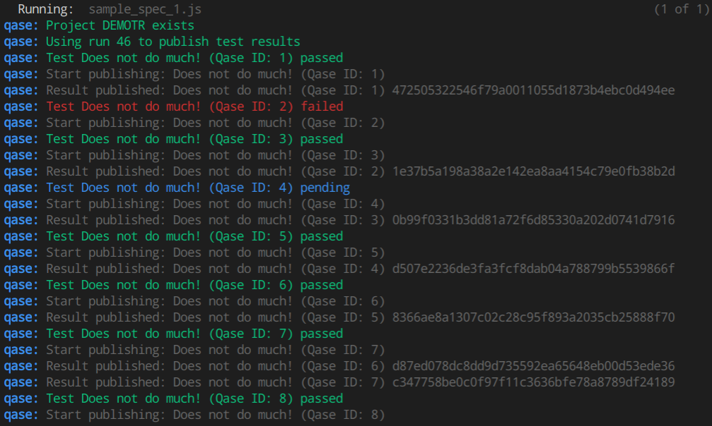

# [Qase TMS](https://qase.io) Cypress Reporter

[](https://www.apache.org/licenses/LICENSE-2.0)

## Installation

```
npm install cypress-qase-reporter
```

## Configuration

Reporter options (* - required):

- *`apiToken` - Token for API access, you can find more information
  [here](https://developers.qase.io/#authentication)
- *`projectCode` - Code of your project (can be extracted from main 
  page of your project: `https://app.qase.io/project/DEMOTR` - 
  `DEMOTR` is project code here)
- `runId` - Run ID from Qase TMS (also can be got from run URL)
- `logging` [true/false] - Enabled debug logging from reporter or not

Example cypress.json config:

```json
{
    "reporter": "cypress-qase-reporter",
    "reporterOptions": {
        "apiToken": "578e3b73a34f06e84eafea103cd44dc24253b2c5",
        "projectCode": "PRJCODE",
        "runId": 45,
        "logging": true
    }
}
```

You can check example configuration with multiple reporters in [demo project](./demo/cypress.json)

Supported ENV variables:

- `QASE_REPORT` - You **should** pass this ENV if you want to use 
  qase reporter
- `QASE_RUN_ID` - Pass Run ID from ENV and override reporter options
- `QASE_RUN_NAME` - Set custom Run name, when new run is created
- `QASE_RUN_DESCRIPTION` - Set custom Run description, when new run is created

## Using Reporter

If you want to decorate come test with Qase Case ID you could use qase function:

```typescript
import { qase } from 'cypress-qase-reporter/dist/mocha';

describe('My First Test', () => {
    qase([1,2],
        it('Several ids', () => {
            expect(true).to.equal(true);
        })
    );
    qase(3,
        it('Correct test', () => {
            expect(true).to.equal(true);
        })
    );
    qase(4,
        it.skip('Skipped test', () => {
            expect(true).to.equal(true);
        })
    );
    qase(5,
        it('Failed test', () => {
            expect(true).to.equal(false);
        })
    );
});

```

## Running Qase Reporter

To start cypress run with qase reporter run it like this:
```bash
QASE_REPORT=1 npx cypress run
```


