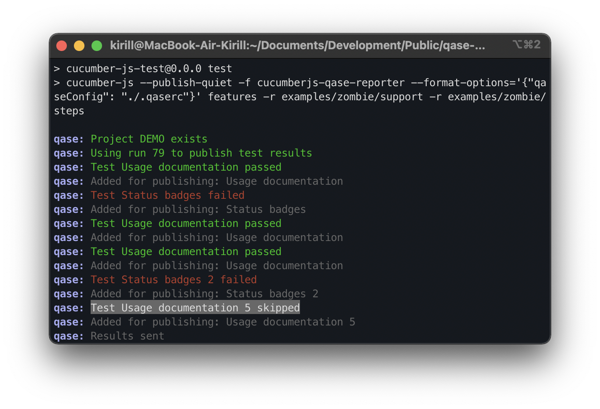

> # Qase TMS Cucumber JS reporter
>
> Publish results simple and easy.

## How to integrate

```
npm install cucumberjs-qase-reporter
```

## Example of usage

Decorate your scenarios with Qase TMS case IDs in format `Q-<case id>` or `Q123`, also `q` can be in any case:

```gherkin
Feature: Cucumber documentation
    As a user of cucumber.js
    I want to have documentation on cucumber
    So I can write better applications

    @sections @Q-2
    Scenario: Usage documentation
        Given I am on the cucumber.js GitHub repository
        When I go to the README file
        Then I should see a "Cool" section
        When I go to the README file

    @ignore @q4
    Scenario: Status badges 2
        Given I am on the cucumber.js GitHub repository
        When I go to the README file
        Then I should see a "Build Status" badge
        And I should see a "Dependencies" badge
```
You should also have an active item in the project settings at

```
https://app.qase.io/project/QASE_PROJECT_CODE/settings/options
```

option in the `Test Runs` block:


```
Allow submitting results in bulk
```

To run tests and create a test run, execute the command (for example from folder examples):

```
npm run test-zombie
```
<p align="center">
  
</p>

A test run will be performed and available at:

```
https://app.qase.io/run/QASE_PROJECT_CODE
```

## Configuration

Qase reporter supports passing parameters using two ways:
using `.qaserc` file and using ENV variables.

`.qaserc` parameters:
- `enabled` - Enable reporter
- `basePath` - URL Qase.io
- `environmentId` - To execute with the sending of the envinroment information
- `apiToken` - Token for API access, you can find more information
  [here](https://developers.qase.io/#authentication)
- `projectCode` - Code of your project (can be extracted from main
  page of your project: `https://app.qase.io/project/DEMOTR` -
  `DEMOTR` is project code here)
- `runId` - Pass Run ID
- `runName` - Set custom Run name, when new run is created.
  Supported parameters:
    - `%DATE%`
- `runDescription` - Set custom Run description, when new run is created
- `logging` - Enabled debug logging from reporter or not

Example configuration file:
```json
{
  "enabled": true,
  "logging": true,
  "apiToken": "api_key",
  "projectCode": "project_code",
  "runName": "CucumberJS run %DATE%",
  "environmentId": 1,
  "basePath": "https://api.qase.io/v1"
}
```

Supported ENV variables:

- `QASE_ENABLED` - Same as `enabled`
- `QASE_API_BASE_URL` - Same as `basePath`
- `QASE_API_TOKEN` - Same as `apiToken`
- `QASE_PROJECT` - Same as `projectCode`
- `QASE_RUN_ID` - Pass Run ID from ENV and override reporter options
- `QASE_RUN_NAME` - Same as `runName`
- `QASE_RUN_DESCRIPTION` - Same as `runDescription`
- `QASE_ENVIRONMENT_ID` - Same as `environmentId`
- `QASE_LOGGING` - Same as `logging`

To run using ENV you have to execute:
```bash
cucumber-js -f cucumberjs-qase-reporter features
```

## Setup with Protractor

Due to different configurations of protractor and cucumber itself you should install a bit more libraries:
```bash
npm install cucumberjs-qase-reporter @cucumber/cucumber @cucumber/messages
```

After that you will be able to use reporter like this (`protractor.conf.js`):
```js
exports.config = {
  ...
  cucumberOpts: {
    require: [
      './tests/e2e/specs/*.js',
    ],  // require step definition files before executing features
    tags: [],
    'dry-run': false,
    compiler: [],  
    format: ["node_modules/cucumberjs-qase-reporter"],
  },
  ...
}
```

**Do not forget to add .qaserc file!**

<!-- references -->

[auth]: https://developers.qase.io/#authentication
