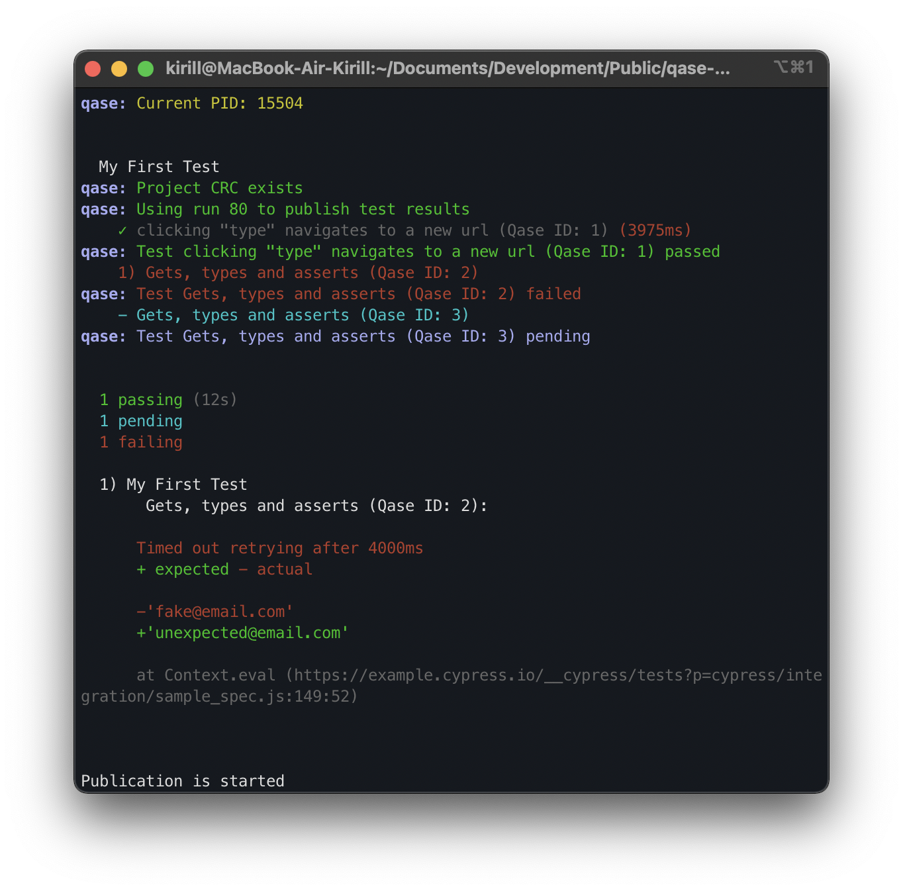

# Qase TMS Cypress reporter

Publish results simple and easy.

## Installation

To install the latest release version (2.2.x), run:

```sh
npm install -D cypress-qase-reporter
```

## Updating from v1 to v2.1

To update an existing test project using Qase reporter from version 1 to version 2.1,
run the following steps:

1. Change import paths in your test files:

   ```diff
   - import { qase } from 'cypress-qase-reporter/dist/mocha'
   + import { qase } from 'cypress-qase-reporter/mocha'
   ```                                        

2. Update reporter configuration in `cypress.config.js` and/or environment variables —
   see the [configuration reference](#configuration) below.

3. Add a hook in the `e2e` section of `cypress.config.js`:

   ```diff
     ...
     e2e: {
   +   setupNodeEvents(on, config) { 
   +     require('cypress-qase-reporter/plugin')(on, config)
       }
     }
     ...
   ```

   If you already override `before:run` or `after:run` hooks in your `cypress.config.js`, use this instead:

   ```diff  
   const { beforeRunHook, afterRunHook } = require('cypress-qase-reporter/hooks');
    
   ...
     e2e: {
       setupNodeEvents(on, config) {
   +     on('before:run', async () => {
   +       console.log('override before:run');
   +       await beforeRunHook(config);
   +     });
     
   +     on('after:run', async () => {
   +       console.log('override after:run');
   +       await afterRunHook(config);
   +     });
       },
     },
     ...
   ```

## Updating from v2.1 to v2.2

To update an existing test project using Qase reporter from version 2.1 to version 2.2,
run the following steps:

1. Add a metadata in the `e2e` section of `cypress.config.js`

   ```diff
     ...
     e2e: {
      setupNodeEvents(on, config) { 
        require('cypress-qase-reporter/plugin')(on, config)
   +    require('cypress-qase-reporter/metadata')(on)
       }
     }
     ...

## Getting started

The Cypress reporter can auto-generate test cases
and suites from your test data.
Test results of subsequent test runs will match the same test cases
as long as their names and file paths don't change.

You can also annotate the tests with the IDs of existing test cases
from Qase.io before executing tests. It's a more reliable way to bind
autotests to test cases, that persists when you rename, move, or
parameterize your tests.

### Metadata

- `qase.title` - set the title of the test case
- `qase.fields` - set the fields of the test case
- `qase.suite` - set the suite of the test case
- `qase.comment` - set the comment of the test case
- `qase.parameters` - set the parameters of the test case
- `qase.groupParameters` - set the group parameters of the test case
- `qase.ignore` - ignore the test case in Qase. The test will be executed, but the results will not be sent to Qase.
- `qase.step` - create a step in the test case
- `qase.attach` - attach a file or content to the test case

For detailed instructions on using annotations and methods, refer to [Usage](docs/usage.md).

For example:

```typescript
import { qase } from 'cypress-qase-reporter/mocha';

describe('My First Test', () => {
  qase(1,
    it('Several ids', () => {
      qase.title('My title');
      expect(true).to.equal(true);
    })
  );
  // a test can check multiple test cases
  qase([2, 3],
    it('Correct test', () => {
      expect(true).to.equal(true);
    })
  );
  qase(4,
    it.skip('Skipped test', () => {
      expect(true).to.equal(true);
    })
  );
});
```

To execute Cypress tests and report them to Qase.io, run the command:

```bash
QASE_MODE=testops npx cypress run
```

or

```bash
npm test
```

You can try it with the example project at [`examples/cypress`](../examples/cypress/).

<p align="center">
  
</p>

A test run will be performed and available at:

```
https://app.qase.io/run/QASE_PROJECT_CODE
```

## Configuration

Qase Cypress reporter can be configured in multiple ways:

- by adding configuration block in `cypress.config.js`,
- using a separate config file `qase.config.json`,
- using environment variables (they override the values from the configuration files).

For a full list of configuration options, see
the [Configuration reference](../qase-javascript-commons/README.md#configuration).

Example `cypress.config.js` config:

```javascript
import cypress from 'cypress';

module.exports = cypress.defineConfig({
  reporter: 'cypress-multi-reporters',
  reporterOptions: {
    reporterEnabled: 'cypress-mochawesome-reporter, cypress-qase-reporter',
    cypressMochawesomeReporterReporterOptions: {
      charts: true,
    },
    cypressQaseReporterReporterOptions: {
      debug: true,

      testops: {
        api: {
          token: 'api_key',
        },

        project: 'project_code',
        uploadAttachments: true,

        run: {
          complete: true,
        },
      },

      framework: {
        cypress: {
          screenshotsFolder: 'cypress/screenshots',
        }
      }
    },
  },
  video: false,
  e2e: {
    setupNodeEvents(on, config) {
      require('cypress-qase-reporter/plugin')(on, config)
      require('cypress-qase-reporter/metadata')(on)
    },
  },
});
```

Check out the example of configuration for multiple reporters in the
[demo project](../examples/cypress/cypress.config.js).

If you use Cucumber, you need to add the following configuration in `cypress.config.js`:

```javascript
import cypress from 'cypress';

const cucumber = require('cypress-cucumber-preprocessor').default;

module.exports = cypress.defineConfig({
  reporter: 'cypress-multi-reporters',
  reporterOptions: {
    reporterEnabled: 'cypress-mochawesome-reporter, cypress-qase-reporter',
    cypressMochawesomeReporterReporterOptions: {
      charts: true,
    },
    cypressQaseReporterReporterOptions: {
      debug: true,

      testops: {
        api: {
          token: 'api_key',
        },

        project: 'project_code',
        uploadAttachments: true,

        run: {
          complete: true,
        },
      },

      framework: {
        cypress: {
          screenshotsFolder: 'cypress/screenshots',
        },
      },
    },
  },
  video: false,
  e2e: {
    setupNodeEvents(on, config) {
      on('file:preprocessor', cucumber());
      require('cypress-qase-reporter/plugin')(on, config);
      require('cypress-qase-reporter/metadata')(on);
    },
    specPattern: 'cypress/e2e/*.feature',
  },
});
``` 

And add the following lines in `support/e2e.js` file:

```javascript
import { enableCucumberSupport } from "cypress-qase-reporter";

enableCucumberSupport();
```

Check out the example of configuration for multiple reporters in the
[demo project](../examples/cypressCucumber/cypress.config.js).

## Requirements

We maintain the reporter on [LTS versions of Node](https://nodejs.org/en/about/releases/).

`cypress >= 8.0.0`

<!-- references -->

[auth]: https://developers.qase.io/#authentication
