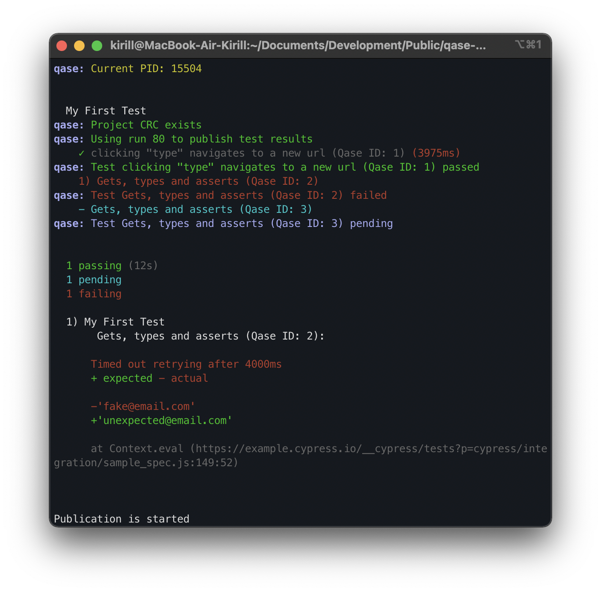

> # Qase TMS Cypress reporter
>
> Publish results simple and easy.

## How to integrate

```
npm install cypress-qase-reporter
```

## Example of usage

The Cypress reporter has the ability to auto-generate test cases
and suites from your test data.

But if necessary, you can independently register the ID of already
existing test cases from TMS before the executing tests. You can decorate your scenarios with Qase TMS case IDs. 
Example:

```typescript
import { qase } from 'cypress-qase-reporter/dist/mocha';

describe('My First Test', () => {
    qase([1,2],
        it('Several ids', () => {
            expect(true).to.equal(true);
        })
    );
    qase(3,
        it('Correct test', () => {
            expect(true).to.equal(true);
        })
    );
    qase(4,
        it.skip('Skipped test', () => {
            expect(true).to.equal(true);
        })
    );
    qase(5,
        it('Failed test', () => {
            expect(true).to.equal(false);
        })
    );
});

```
You should also have an active item in the project settings at
```
https://app.qase.io/project/QASE_PROJECT_CODE/settings/options
```
options in the `Test Runs` block:
```
Auto create test cases
```
and
```
Allow submitting results in bulk
```
---
If you are going to use several specifications for execution and you have in config 
```bash
"runComplete": true
```
then it is necessary to additionally set in the project settings
```
Allow to add results for cases in closed runs.
```
---
To run tests and create a test run, execute the command (for example from folder examples):
```bash
QASE_REPORT=1 npx cypress run
```
or
```bash
npm test
```
<p align="center">
  
</p>

A test run will be performed and available at:

```
https://app.qase.io/run/QASE_PROJECT_CODE
```

<p align="center">
  
</p>

## Configuration

Reporter options (* - required):

- *`apiToken` - Token for API access, you can find more information
  [here](https://developers.qase.io/#authentication)
- *`projectCode` - Code of your project (can be extracted from main 
  page of your project: `https://app.qase.io/project/DEMOTR` - 
  `DEMOTR` is project code here)
- `runId` - Run ID from Qase TMS (also can be got from run URL)
- `logging` [true/false] - Enabled debug logging from reporter or not
- `environmentId` - To execute with the sending of the envinroment information
- `basePath` - URL Qase.io
- `screenshotFolder` - Folder for save screenshot cypress,
- `sendScreenshot` [true/false] - Permission to send screenshots to Qase TMS
- `runComplete` [true/false] - Permission for automatic completion of the test run
- `rootSuiteTitle` - A parent suite for your autocreated tests

Example `cypress.json` config:

```json
{
    "reporter": "cypress-qase-reporter",
    "reporterOptions": {
        "apiToken": "api_key",
        "projectCode": "project_code",
        "runId": 45,
        "logging": true,
        "basePath": "https://api.qase.io/v1",
        "runComplete": false
    }
}
```

You can check example configuration with multiple reporters in [demo project](./demo/cypress.json).

Supported ENV variables:

- `QASE_REPORT` - You **should** pass this ENV if you want to use 
  qase reporter
- `QASE_RUN_ID` - Pass Run ID from ENV and override reporter options
- `QASE_RUN_NAME` - Set custom Run name, when new run is created
- `QASE_RUN_DESCRIPTION` - Set custom Run description, when new run is created
- `QASE_API_TOKEN` - Token for API access, you can find more information
  [here](https://developers.qase.io/#authentication)
- `QASE_API_BASE_URL` - URL Qase.io, default value `https://api.qase.io/v1`
- `QASE_ENVIRONMENT_ID` - To execute with the sending of the envinroment information
- `QASE_SCREENSHOT_FOLDER` - Folder for save screenshot cypress
- `QASE_SCREENSHOT_SENDING` - Permission to send screenshots to Qase TMS
- `QASE_RUN_COMPLETE` - Permission for automatic completion of the test run
- `QASE_ROOT_SUITE_TITLE` - Same as `rootSuiteTitle`

<!-- references -->

[auth]: https://developers.qase.io/#authentication
