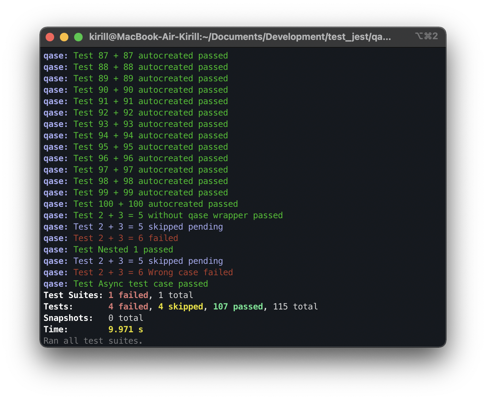

> # Qase TMS Jest reporter
>
> Publish results simple and easy.

## How to integrate

```
npm install jest-qase-reporter
```

## Using Reporter

The Jest reporter has the ability to auto-generate test cases
and suites from your test data.

But if necessary, you can independently register the ID of already
existing test cases from TMS before the executing tests. For example:

```typescript
import { qase } from 'jest-qase-reporter/dist/jest';

describe('My First Test', () => {
    test(qase([1,2], 'Several ids'), () => {
        expect(true).toBe(true);
    })

    test(qase(3, 'Correct test'), () => {
        expect(true).toBe(true);
    })

    test.skip(qase("4", 'Skipped test'), () => {
        expect(true).toBe(true);
    })

    test(qase(["5", "6"], 'Failed test'), () => {
        expect(true).toBe(false);
    })
});
```

You should also have an active item in the project settings at

```
https://app.qase.io/project/QASE_PROJECT_CODE/settings/options
```

options in the `Test Runs` block:

```
Auto create test cases
```
and
```
Allow submitting results in bulk
```

To run tests and create a test run, execute the command (for example from folder examples):
```bash
QASE_REPORT=1 npx jest
```
or
```bash
npm test
```

<p align="center">
  
</p>

A test run will be performed and available at:

```
https://app.qase.io/run/QASE_PROJECT_CODE
```

## Configuration

Reporter options (* - required):

- *`apiToken` - Token for API access, you can find more information
  [here](https://developers.qase.io/#authentication)
- *`projectCode` - Code of your project (can be extracted from main 
  page of your project: `https://app.qase.io/project/DEMOTR` - 
  `DEMOTR` is project code here)
- `runId` - Run ID from Qase TMS (also can be got from run URL)
- `environmentId` - Environment ID from Qase TMS
- `logging` [true/false] - Enabled debug logging from reporter or not
- `runComplete` [true/false] - Complete run after all tests are finished

Example `jest.config.js` config:

```js
module.exports = {
  reporters: [
    'default',
    [
      'jest-qase-reporter',
      {
        apiToken: 'api_key',
        projectCode: 'project_code',
        runId: 45,
        environmentId: 1,
        logging: true,
        runComplete: true,
      },
    ],
  ],
  ...
};
```

You can check example configuration with multiple reporters in [example project](./examples/jest.config.js).

Supported ENV variables:

- `QASE_REPORT` - You **should** pass this ENV if you want to use 
  qase reporter
- `QASE_API_TOKEN` - API token
- `QASE_PROJECT_CODE` - Your project code
- `QASE_ROOT_SUITE_TITLE` - Setting the root suite that the reporter will use
- `QASE_RUN_ID` - Pass Run ID from ENV and override reporter options
- `QASE_ENVIRONMENT_ID` - Pass Environment ID from ENV and override reporter options
- `QASE_RUN_NAME` - Set custom Run name, when new run is created
- `QASE_RUN_DESCRIPTION` - Set custom Run description, when new run is created
- `QASE_RUN_COMPLETE` - Complete run after all tests are finished

<!-- references -->

[auth]: https://developers.qase.io/#authentication
