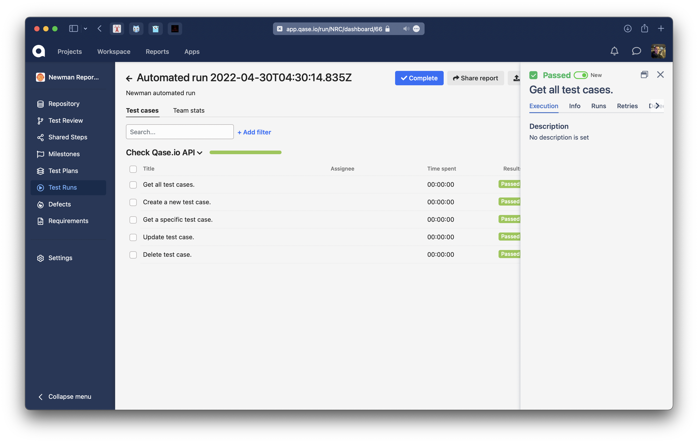

> # Qase TMS Newman reporter
>
> Publish results simple and easy.

## How to integrate

```bash
npm install newman-reporter-qase
```

## Example of usage

### Define in tests
```js
//qase: 10
// Qase: 1, 2, 3
// qase: 4 5 6 14
pm.test('expect response be 200', function () {
    pm.response.to.be.info
})
```
You should also have an active item in the project settings at

```
https://app.qase.io/project/QASE_PROJECT_CODE/settings/options
```

option in the `Test Runs` block:

```
Allow submitting results in bulk
```
### Execute rom CLI:
```
QASE_RUN_ID=34 # Specify Run ID using ENV
newman run \
    -r qase \ # Enable Qase logger
    --reporter-qase-logging \ # Use reporter logger (like debug)
    --reporter-qase-projectCode project_code \ # Specify Project Code
    --reporter-qase-apiToken api_token \ # Specify API token
    --reporter-qase-runId 34 \ # Specify Run ID using CLI parameters
    --reporter-qase-basePath https://api.qase.io/v1 \ # URL Qase.io
    --reporter-qase-runName "API test Execution" \ # Specify Run name using CLI parameters
    --reporter-qase-runDescription "Check API consistency" \ # Specify Run description using CLI parameters
    -x # WA for issue https://github.com/postmanlabs/newman/issues/2148#issuecomment-665229759
```
To run tests and create a test run, execute the command (for example from folder examples):
```bash
npm test
```

<p align="center">
  
</p>

A test run will be performed and available at:

```
https://app.qase.io/run/QASE_PROJECT_CODE
```

<p align="center">
  
</p>

To execute the tests locally, without sending the results, you can use the command:
```bash
npm run test:local
```
<!-- references -->

[auth]: https://developers.qase.io/#authentication
