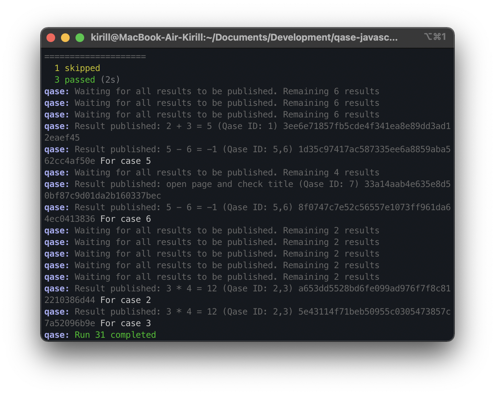

> # Qase TMS Playwright reporter
>
> Publish results simple and easy.

## How to integrate

```
npm install playwright-qase-reporter
```


## Example of usage

The Playwright reporter has the ability to auto-generate test cases
and suites from your test data.

But if necessary, you can independently register the ID of already
existing test cases from TMS before the executing tests. For example:

```typescript
import { qase } from 'playwright-qase-reporter/dist/playwright';

describe('Test suite', () => {
    test(qase([1,2], 'Several ids'), () => {
        expect(true).toBe(true);
    })

    test(qase(3, 'Correct test'), () => {
        expect(true).toBe(true);
    })

    test.skip(qase("4", 'Skipped test'), () => {
        expect(true).toBe(true);
    })

    test(qase(["5", "6"], 'Failed test'), () => {
        expect(true).toBe(false);
    })
});

```
---
To run tests and create a test run, execute the command (for example from folder examples):
```bash
QASE_REPORT=1 npx playwright test
```
or
```bash
npm test
```

<p align="center">
  
</p>

A test run will be performed and available at:

```
https://app.qase.io/run/QASE_PROJECT_CODE
```

<p align="center">
  
</p>

## Configuration

Reporter options (* - required):

- *`apiToken` - Token for API access, you can find more information
  [here](https://developers.qase.io/#authentication)
- *`projectCode` - Code of your project (can be extracted from main 
  page of your project: `https://app.qase.io/project/DEMOTR` - 
  `DEMOTR` is project code here)
  `basePath` - Qase.io url
- `runId` - Run ID from Qase TMS (also can be got from run URL)
- `environmentId` - Environment ID from Qase TMS
- `logging` [true/false] - Enabled debug logging from reporter or not
- `runComplete` [true/false] - Complete run after all tests are finished
- `uploadAttachments` [true/false] - Uploading attachments (screenshot/video) after test ended
- `rootSuiteTitle` - A parent suite for your autocreated tests

Example `playwright.config.js` config:

```js
const config = {
    use: {
        screenshot: 'only-on-failure',
        video: 'retain-on-failure',
    },
    reporter: [
        ['list'],
        ['playwright-qase-reporter',
            {
                apiToken: 'api_key',
                projectCode: 'project_code',
                runComplete: true,
                basePath: 'https://api.qase.io/v1',
                logging: true,
                uploadAttachments: true,
            }],
    ],
};
module.exports = config;
```

You can check example configuration with multiple reporters in [example project](./examples/playwright.config.js).

Supported ENV variables:

- `QASE_REPORT` - You **should** pass this ENV if you want to use qase reporter
- `QASE_API_TOKEN` - API token
- `QASE_PROJECT_CODE` - Code of your project (can be extracted from main page of your project: https://app.qase.io/project/DEMOTR - DEMOTR is project code here)
- `QASE_API_BASE_URL` - Qase.io url
- `QASE_RUN_ID` - Pass Run ID from ENV and override reporter options
- `QASE_ENVIRONMENT_ID` - Pass Environment ID from ENV and override reporter options
- `QASE_RUN_NAME` - Set custom Run name, when new run is created
- `QASE_RUN_DESCRIPTION` - Set custom Run description, when new run is created
- `QASE_RUN_COMPLETE` - Complete run after all tests are finished
- `QASE_UPLOAD_ATTACHMENTS` - Uploading attachments (screenshot/video) after test ended
- `QASE_ROOT_SUITE_TITLE` - Same as `rootSuiteTitle`

## Requirements

We maintain the reporter on LTS versions of Node. You can find the current versions by following the [link](https://nodejs.org/en/about/releases/)

<!-- references -->

[auth]: https://developers.qase.io/#authentication
