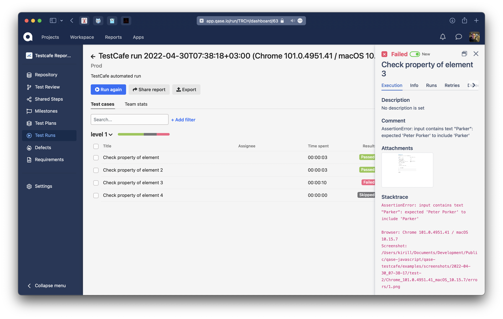

> # Qase TMS TestCafe reporter
>
> Publish results simple and easy.

## How to integrate

```
npm install testcafe testcafe-reporter-qase
```

## Example of usage

In order to use reporter, you should add meta information to your tests. Meta key should be `CID`.
You should assign list of case IDs to it, e.g.:
```js
test
    .meta('CID', [1])
    ('Text typing basics', async (t) => {
        await t
    });

test
    .meta({ CID: [2, 3] })
    ('Click check boxes and then verify their state', async (t) => {
        await t
    });
```
You should also have an active item in the project settings at
```
https://app.qase.io/project/QASE_PROJECT_CODE/settings/options
```
option in the `Test Runs` block:
```
Allow submitting results in bulk
```
To run tests and create a test run, execute the command (for example from folder examples):
```bash
npx testcafe chrome test.js -r spec,qase
```
or
```bash
npm test
```

<p align="center">
  
</p>

A test run will be performed and available at:

```
https://app.qase.io/run/QASE_PROJECT_CODE
```

<p align="center">
  
</p>

To execute the tests locally, without sending the results, you can use the command:
```bash
npm run test:local
```
## Configuration

Qase reporter supports passing parameters using two ways: 
using `.qaserc` file and using ENV variables.

`.qaserc` parameters:
- `enabled` - Enable reporter
- `apiToken` - Token for API access, you can find more information
  [here](https://developers.qase.io/#authentication)
- `basePath` - Qase.io URL
- `projectCode` - Code of your project (can be extracted from main
  page of your project: `https://app.qase.io/project/DEMOTR` -
  `DEMOTR` is project code here)
- `runId` - Pass Run ID
- `environmentId` - Environment ID from Qase TMS
- `runName` - Set custom Run name, when new run is created.
  Supports two parameters:
    - `%DATE%`
    - `%AGENTS%`
- `runDescription` - Set custom Run description, when new run is created
- `uploadAttachments` - Uploading attachment to Qase TMS
- `runComplete` - Complete run after all tests are finished
- `logging` - Enabled debug logging from reporter or not

Example configuration file:
```json
{
    "enabled": true,
    "logging": true,
    "apiToken": "api_key",
    "projectCode": "project_code",
    "runName": "TestCafe run %DATE% %AGENTS%"
}
```

Supported ENV variables:

- `QASE_ENABLED` - Same as `enabled`
- `QASE_API_TOKEN` - Same as `apiToken`
- `QASE_PROJECT` - Same as `projectCode`
- `QASE_RUN_ID` - Pass Run ID from ENV and override reporter options
- `QASE_RUN_NAME` - Same as `runName`
- `QASE_RUN_DESCRIPTION` - Same as `runDescription`
- `QASE_RUN_COMPLETE` - Same as `runComplete`
- `QASE_LOGGING` - Same as `logging`
- `QASE_UPLOAD_ATTACHMENTS` - Same as `uploadAttachments`

<!-- references -->

[auth]: https://developers.qase.io/#authentication
